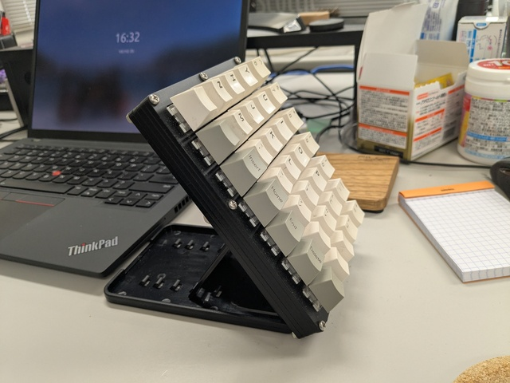

# 関節リウマチになった話

前田 修吾  
株式会社ネットワーク応用通信研究所

## 経緯

* 5月末に肩の痛みで整形外科を受診
* 7月末に指の第1関節の腫れ、手首・足・膝・股関節の痛み
* 8/2に症状悪化、38℃の発熱もあり救急外来を受診
* 8/4に総合診療科、8/7に膠原病外来を受診
* 血液検査などの結果、8/21に関節リウマチの診断

## 血液検査

* CRP: 1.55 mg/dl (基準値0.00-0.30)
* リウマチ因子: 38.7 IU/ml (基準値15未満)
* 抗CCP抗体: 340 U/ml (基準値4.5未満)

## 関節リウマチとは

* 自己免疫疾患
* 免疫系の異常で自分の関節を攻撃してしまう
* 30〜50代の女性に多い (男:女 = 1:4)

## 関節リウマチの原因

* はっきり解明されていない
  * 遺伝子の異常?
  * ウィルス・細菌の影響?

## 関節リウマチの症状

* こわばり
* 関節の腫れ・痛み
* 関節の変形

## 関節リウマチのつらさ

* 痛い
* バイクに乗れない
* 釣りができない
* タイピングがつらい

## キーボードのテンティング

## 治療

* (ステロイド)
* NSAIDs
* 抗リウマチ薬
* 生物学的製剤
* (JAK阻害薬)

## NSAIDs

* 非ステロイド系抗炎症薬
* ロキソニン

## 抗リウマチ薬

* 免疫異常を改善させることにより炎症を抑える薬
* メトトレキサート
  * 葉酸拮抗薬
  * 免疫細胞(以外も)の増殖を抑える
  * 金曜朝2錠、夕1錠、土曜朝1錠
  * 月曜の朝にフォリアミン(葉酸)で解毒

## 生物学的製剤

* 遺伝子組み換え・細胞培養などの生物学的技法によりつくられた薬剤
* タンパク質
* 皮下注射・点滴などで投与
* TNF-α、IL-6などのサイトカインを選択的に阻害する
* アダリムマブ
  * ヒト型抗ヒトTNF-αモノクローナル抗体製剤
  * 2週間に1回投与

## オートインジェクター

## 命名規約

* adalimumab
  * ada (接頭語)
  * lim (標的: 免疫細胞)
  * u (ヒト抗体)
  * mab (モノクローナル抗体)

## 治療経過

* CRP: 0.03 mg/dl (基準値0.00-0.30)
* 膝はだいぶよくなった
* 肩の痛みはよくなっていない

## To be continued...
